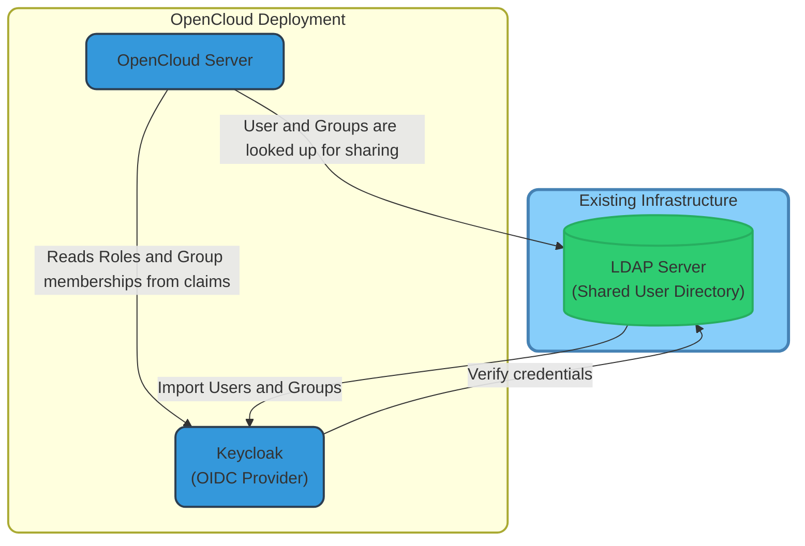
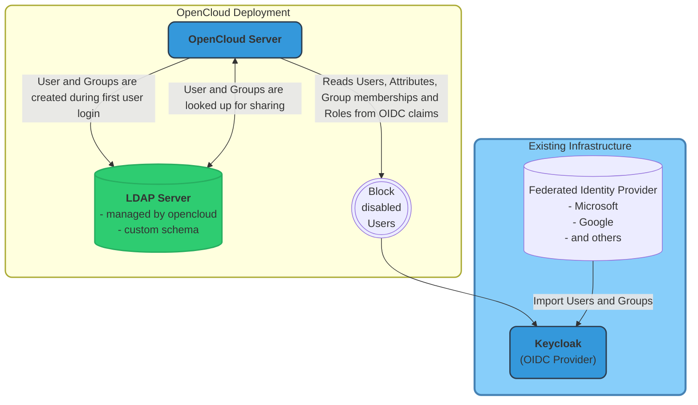

# Keycloak Integration

OpenCloud supports using Keycloak as an external identity provider, providing enterprise-grade identity management capabilities. This guide explains how to set up and configure Keycloak with OpenCloud.
This guide is divided into three main sections:

- **[Keycloak Integration Overview](#opencloud-configuration-for-keycloak-general)**: A brief overview of the integration process.
- **[Shared User Directory Mode](#configuration-for-shared-directory-mode)**: Keycloak and OpenCloud share a common LDAP directory for user management.
- **[Autoprovisioning Mode](#configuration-for-autoprovisioning-mode)**: OpenCloud autoprovisions users in a separate LDAP directory managed by OpenCloud.

## OpenCloud Configuration for Keycloak (General)

When using Keycloak as the identity provider, you need to understand the general configuration settings if you want to configure your custom integration.

You can also use one of our predefined Docker Compose setups, which are located in the `deployments/examples/opencloud_full` directory. These setups include all necessary configurations for Keycloak and OpenLDAP.

### Server Configuration

```env
PROXY_AUTOPROVISION_ACCOUNTS=true|false # that depends on your setup
PROXY_ROLE_ASSIGNMENT_DRIVER=oidc
OC_OIDC_ISSUER=https://your-domain.example.com/realms/openCloud
WEB_OPTION_ACCOUNT_EDIT_LINK_HREF=https://your-domain.example.com/realms/openCloud/account
PROXY_OIDC_REWRITE_WELLKNOWN=true
PROXY_USER_OIDC_CLAIM=preferred_username|sub|uuid # this depends on your setup
# admin and demo accounts must be created in Keycloak
OC_ADMIN_USER_ID: ""
SETTINGS_SETUP_DEFAULT_ASSIGNMENTS: "false"
GRAPH_ASSIGN_DEFAULT_USER_ROLE: "false"
GRAPH_USERNAME_MATCH=none
OC_EXCLUDE_RUN_SERVICES=idp,idm # it is not supported to run keycloak with the built-in idm
```

Look [OpenCloud external IDP configuration](./external-idp.md#opencloud-configuration) for some more details about these settings.

### Client Configuration

The [OIDC clients](./external-idp.md#client-configuration) required by OpenCloud are pre-configured in the Docker Compose setup and match the clients used by the built-in IdP.

### Manual Client Configuration

If you need to manually configure the clients in Keycloak:

1. Log in to the Keycloak admin console
2. Select the OpenCloud realm
3. Navigate to Clients and click Create
4. Configure each client according to the specifications above
5. Ensure all clients have the appropriate scopes:
   - web-origins
   - profile
   - roles
   - groups
   - basic
   - email

### Advanced Configuration

#### Backchannel Logout

OpenCloud supports Keycloak's backchannel logout feature, which allows Keycloak to notify OpenCloud when a user logs out. This ensures that all sessions are properly terminated:

- **Backchannel Logout URL**: `https://your-domain.example.com/backchannel_logout`
- **Backchannel Logout Session Required**: `true`

## Shared User Directory Mode



In this mode, a readable LDAP Directory with existing users serves as a central user directory for both Keycloak and OpenCloud.

**Key characteristics:**

- LDAP is the source of truth for user information
- The LDAP server uses standard attributes (uid, cn, sn, givenName, mail)
- A common unique identifier (e.g. `entryUUID` or `objectGUID`) guarantees stable user mapping even if users are changing
- Both Keycloak and OpenCloud read user data directly from LDAP
- User accounts must exist in LDAP before they can log in or receive shares
- LDAP is configured as read-only for OpenCloud
- OpenCloud can create custom groups only if a subtree of the read-only LDAP can be writable

### LDAP Assumptions for Shared Directory Mode

OpenCloud can work with any LDAP schema containing standard attributes:

- User attributes: `uid`, `cn`, `sn`, `givenName`, `mail`
- Groups are stored in a dedicated organizational unit
- Default configuration sets LDAP as read-only

**Example LDAP Structure:**

```bash
dc=example,dc=org              # Base DN
├── ou=users                   # User organizational unit
│   ├── uid=user1              # User entries
│   └── uid=user2
└── ou=groups                  # Group organizational unit
    ├── cn=admins              # Group entries
    ├── cn=users
    └── ou=custom (optional)   # Optional custom groups tree, writable by OpenCloud
        ├── cn=teamA           # Custom Group entries
        └── cn=teamB
```

:::tip

It is possible to use a writable subtree of the LDAP server for custom groups. This is useful if you want to create groups in OpenCloud that are not managed by Keycloak.

This feature is optional and can be disabled by setting `GRAPH_LDAP_GROUP_CREATE_BASE_DN` to an empty string.

:::

### Configuration for Shared Directory Mode

Keycloak and OpenCloud can be configured using environment variables:

```bash
# Basic Keycloak configuration
KEYCLOAK_DOMAIN=keycloak.example.org
KEYCLOAK_REALM=openCloud

# OpenCloud OIDC configuration
OC_OIDC_ISSUER=https://${KEYCLOAK_DOMAIN:-keycloak.opencloud.test}/realms/${KEYCLOAK_REALM:-openCloud}
WEB_OPTION_ACCOUNT_EDIT_LINK_HREF=https://${KEYCLOAK_DOMAIN:-keycloak.opencloud.test}/realms/${KEYCLOAK_REALM:-openCloud}/account
PROXY_OIDC_REWRITE_WELLKNOWN=true
PROXY_USER_OIDC_CLAIM=uuid # this claim needs to be configured in the keycloak realm to use the keycloak user id
PROXY_USER_CS3_CLAIM=userid
# admin and demo accounts must be created in Keycloak
OC_ADMIN_USER_ID=""
SETTINGS_SETUP_DEFAULT_ASSIGNMENTS=false
GRAPH_ASSIGN_DEFAULT_USER_ROLE=false
GRAPH_USERNAME_MATCH=none

# OpenCloud LDAP configuration
OC_LDAP_URI=ldaps://ldap-server:1636
OC_LDAP_SERVER_WRITE_ENABLED=false # assuming the external ldap main tree is not writable
# Disable non writable attributes in the OpenCloud Admin UI
FRONTEND_READONLY_USER_ATTRIBUTES="user.onPremisesSamAccountName,user.displayName,user.mail,user.passwordProfile,user.accountEnabled,user.appRoleAssignments"
OC_LDAP_INSECURE=true
OC_LDAP_BIND_DN=cn=admin,dc=opencloud,dc=eu
OC_LDAP_BIND_PASSWORD=admin-password
OC_LDAP_USER_BASE_DN=ou=users,dc=opencloud,dc=eu
OC_LDAP_USER_SCHEMA_ID=entryUUID
OC_LDAP_DISABLE_USER_MECHANISM=none
OC_LDAP_GROUP_BASE_DN=ou=groups,dc=opencloud,dc=eu
OC_LDAP_GROUP_SCHEMA_ID=entryUUID
# Custom groups feature when a writable subtree is available
GRAPH_LDAP_GROUP_CREATE_BASE_DN=ou=custom,ou=groups,dc=opencloud,dc=eu
GRAPH_LDAP_SERVER_UUID=true

```

### Example Docker Compose Configuration - Shared Directory Mode

OpenCloud provides complete example deployments using Docker Compose:

1. Navigate to `deployments/examples/opencloud_full`
2. Edit the `.env` file to enable the Shared Directory Mode:

**For Shared Directory Mode:**

```bash
# Enable services
LDAP=:ldap.yml
KEYCLOAK_DOMAIN=your-keycloak-domain.example.com # your public keycloak domain without protocol
KEYCLOAK=:keycloak.yml
# Comment out the autoprovisioning configuration
# KEYCLOAK_AUTOPROVISIONING=:keycloak-autoprovisioning.yml
```

The Docker Compose files `keycloak.yml`, `ldap.yml` contain the complete configuration for each component.

Keycloak is configured during startup by importing the `keycloak-realm.dist.json` file. This file contains the configuration for the OpenCloud realm, including client settings, roles, and user federation. This file is located in the `deployments/examples/opencloud_full/config/keycloak` directory.

:::warning

Keycloak can import the realm configuration file **only once** during the first startup. If you need to change the configuration, you must delete the Keycloak container and volume and restart it. This will reset Keycloak to its initial state.

:::

## Autoprovisioning Mode

In this mode, Keycloak is holding all users and OpenCloud autoprovisions new users during first login.
This mode is suitable in scenarios where the OpenIDConnect provider is external and not under control of the OpenCloud admin. To mitigate that lack of control, OpenCloud will use an LDAP server which is fully under the control of the OpenCloud admin to store the users and groups and additional attributes.



- Keycloak manages the users, groups, and roles
- The openCloud Clients and Sessions are configured in Keycloak
- Simplified user management with "just-in-time" provisioning
- Federation with external identity providers is supported (e.g., Google, GitHub, Facebook, Microsoft)
- In this case, we need to provide an LDAP server which is fully controlled by OpenCloud and needs a custom [LDAP Schema](https://github.com/opencloud-eu/opencloud/blob/main/deployments/examples/shared/config/ldap/schemas/10_opencloud_schema.ldif).

### Configuration for Autoprovisioning Mode

Keycloak, OpenCloud and OpenLDAP can be configured using environment variables:

```bash
# Basic Keycloak configuration
KEYCLOAK_DOMAIN=keycloak.example.org
KEYCLOAK_REALM=openCloud

# OpenCloud OIDC configuration
OC_OIDC_ISSUER=https://${KEYCLOAK_DOMAIN:-keycloak.opencloud.test}/realms/${KEYCLOAK_REALM:-openCloud}
WEB_OPTION_ACCOUNT_EDIT_LINK_HREF=https://${KEYCLOAK_DOMAIN:-keycloak.opencloud.test}/realms/${KEYCLOAK_REALM:-openCloud}/account
PROXY_OIDC_REWRITE_WELLKNOWN=true
PROXY_USER_OIDC_CLAIM=sub
PROXY_AUTOPROVISION_CLAIM_USERNAME=sub
PROXY_USER_CS3_CLAIM=username
# admin and demo accounts must be created in Keycloak
OC_ADMIN_USER_ID=""
SETTINGS_SETUP_DEFAULT_ASSIGNMENTS=false
GRAPH_ASSIGN_DEFAULT_USER_ROLE=false
GRAPH_USERNAME_MATCH=none

# OpenCloud LDAP configuration
OC_LDAP_URI=ldaps://ldap-server:1636
OC_LDAP_SERVER_WRITE_ENABLED=true
# Disable non writable attributes in the OpenCloud Admin UI
FRONTEND_READONLY_USER_ATTRIBUTES="user.onPremisesSamAccountName,user.displayName,user.mail,user.passwordProfile,user.memberOf"
OC_LDAP_INSECURE=true
OC_LDAP_BIND_DN=cn=admin,dc=opencloud,dc=eu
OC_LDAP_BIND_PASSWORD=admin-password
OC_LDAP_USER_BASE_DN=ou=users,dc=opencloud,dc=eu
OC_LDAP_DISABLE_USER_MECHANISM=none
OC_LDAP_GROUP_BASE_DN=ou=groups,dc=opencloud,dc=eu
```

### Example Docker Compose Configuration - Autoprovisioning Mode

OpenCloud provides complete example deployments using Docker Compose:

1. Navigate to `deployments/examples/opencloud_full`
2. Edit the `.env` file to enable the Autoprovisioning Mode:

**For Autoprovisioning Mode:**

```bash
# Enable services
LDAP=:ldap.yml
KEYCLOAK_DOMAIN=your-keycloak-domain.example.com # your public keycloak domain without protocol
KEYCLOAK=:keycloak.yml
KEYCLOAK_AUTOPROVISIONING=:keycloak-autoprovisioning.yml
```

The Docker Compose files `keycloak.yml`, `ldap.yml`, and `keycloak-autoprovisioning.yml` contain the complete configuration for each component. The file `10_opencloud_ldap_schema.ldif` contains the OpenCloud LDAP schema and is loaded during the startup of the OpenLdap container.

Keycloak is configured during startup by importing the `keycloak-autoprovisioning-realm.dist.json` file. This file contains the configuration for the OpenCloud realm, including client settings, roles, users and groups. This file is located in the `deployments/examples/opencloud_full/config/keycloak` directory.

:::warning

Keycloak can import the realm configuration file **only once** during the first startup. If you need to change the configuration, you must delete the Keycloak container and volume and restart it. This will reset Keycloak to its initial state.

:::

## Troubleshooting

Common issues and solutions:

- **User cannot log in**:
  - Check LDAP connectivity and user existence
  - Check if each user has an OpenCloud Role assigned
  - Verify that the client IDs and redirect URIs match exactly
- **Groups not synchronized**: Verify group mappings in Keycloak
- **User creation fails (autoprovisioning mode)**: Ensure LDAP has write permissions in Autoprovisioning Mode
