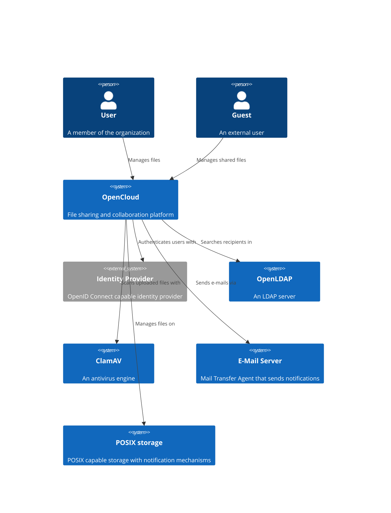

```mermaid
C4Context
  Person(user, "User", "A member of the organization")
  Person(externalperson, "Guest", "An external user")
  
  System(opencloud, "OpenCloud", "File sharing and collaboration platform")
  System_Ext(idp, "Identity Provider", "OpenID Connect capable identity provider")
  
  Rel(user, opencloud, "Manages files")
  Rel(opencloud, idp, "Authenticates users with")
  Rel(externalperson, opencloud, "Manages shared files")
  
  System(openldap, "OpenLDAP", "An LDAP server")
  System(clamav, "ClamAV", "An antivirus engine")
  System(mta, "E-Mail Server", "Mail Transfer Agent that sends notifications")
  System(storage, "POSIX storage", "POSIX capable storage with notification mechanisms")
  
  Rel(opencloud, openldap, "Searches recipients in")
  Rel(opencloud, clamav, "Scans uploaded files with")
  Rel(opencloud, mta, "Sends e-mails via")
  Rel(opencloud, storage, "Manages files on")
```